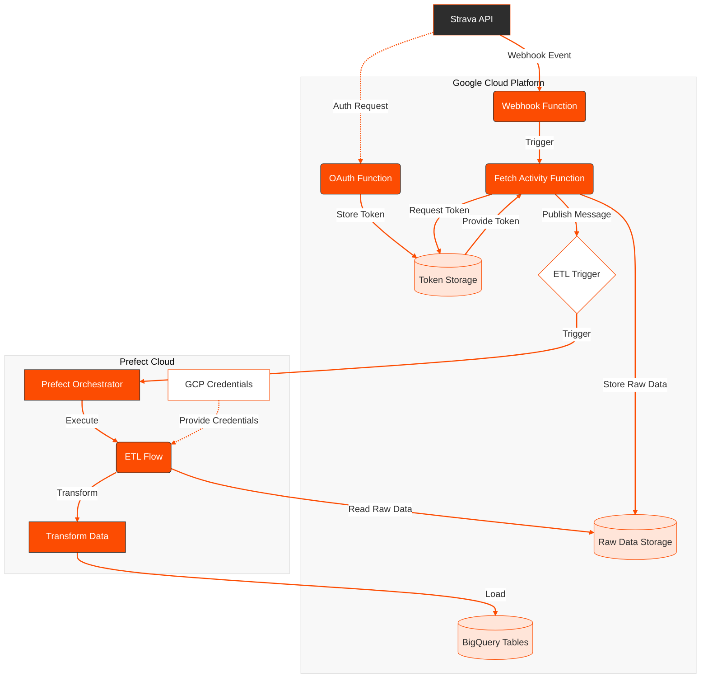

# Strava ETL Pipeline

An event-driven ETL pipeline that processes Strava activities using Google Cloud Platform and Prefect. This system automatically captures new Strava activities, processes them, and stores them in BigQuery for analysis.

## System Architecture



The system consists of several components:
- **OAuth Flow**: Handles user authentication with Strava
- **Webhook Handler**: Receives activity notifications from Strava
- **Data Fetcher**: Retrieves detailed activity data
- **ETL Pipeline**: Processes and loads data into BigQuery
- **Orchestration**: Manages workflow using Prefect Cloud

## Project Structure

```
.
├── cloud_functions/
│   ├── fetch-data/         # Activity data fetching function
│   ├── oauth/              # Strava OAuth handling
│   ├── trigger_prefect/    # Prefect flow trigger function
│   └── webhooks/           # Strava webhook handler
├── docs/
│   ├── guides/
│   │   ├── webhook_guide.md
│   │   └── ngrok_guide.md
│   └── setup/
│       ├── gcp_setup.md
│       ├── bigquery_schemas.md
│       └── prefect_setup.md
├── local_scripts/          # Development and testing scripts
├── prefect/
│   ├── flows/              # Prefect flow definitions
│   └── deployments/        # Deployment configurations
└── README.md
```

## Prerequisites

- Google Cloud Platform Account
- Strava API Access
- Prefect Cloud Account
- Python 3.12+
- Required Python packages (see `requirements.txt`)

## Setup Instructions

1. **GCP Setup**
   - Create a new GCP project
   - Enable required APIs (Cloud Functions, Cloud Storage, BigQuery)
   - Set up service account with necessary permissions
   - See [GCP Setup Guide](docs/setup/gcp_setup.md)

2. **Strava API Configuration**
   - Create Strava API application
   - Configure OAuth settings
   - Set up webhook subscription
   - See [Webhook Guide](docs/guides/webhook_guide.md)

3. **Prefect Setup**
   - Configure Prefect Cloud workspace
   - Set up GCP credentials block
   - Deploy ETL flow
   - See [Prefect Setup Guide](docs/setup/prefect_setup.md)

## Environment Variables

```bash
# Strava Configuration
STRAVA_CLIENT_ID=your_client_id
STRAVA_CLIENT_SECRET=your_client_secret
STRAVA_VERIFY_TOKEN=your_verify_token

# GCP Configuration
PROJECT_ID=your_project_id
BUCKET_NAME=your_bucket_name

# Prefect Configuration
PREFECT_API_KEY=your_prefect_api_key
```

## Deployment

1. Deploy Cloud Functions:
```bash
gcloud functions deploy webhook-handler \
  --runtime python39 \
  --trigger-http \
  --entry-point webhook
```

2. Deploy Prefect Flow:
```bash
python prefect/deployments/deploy_etl.py
```

## Development

For local development and testing:
1. Set up local environment:
```bash
python -m venv venv
source venv/bin/activate
pip install -r requirements.txt
```

2. Use ngrok for webhook testing:
```bash
# See ngrok setup guide in docs/guides/ngrok_guide.md
ngrok http 8000
```

## Contributing

1. Fork the repository
2. Create a feature branch
3. Make your changes
4. Submit a pull request

## Troubleshooting

Common issues and solutions:
- **Webhook Issues**: See [Webhook Guide](docs/guides/webhook_guide.md)
- **OAuth Errors**: Check Strava API credentials and callback URLs
- **GCP Permissions**: Verify service account roles
- **Prefect Errors**: Check credentials block and deployment settings

## License

[Your License Type]

## Contact

[Your Contact Information]